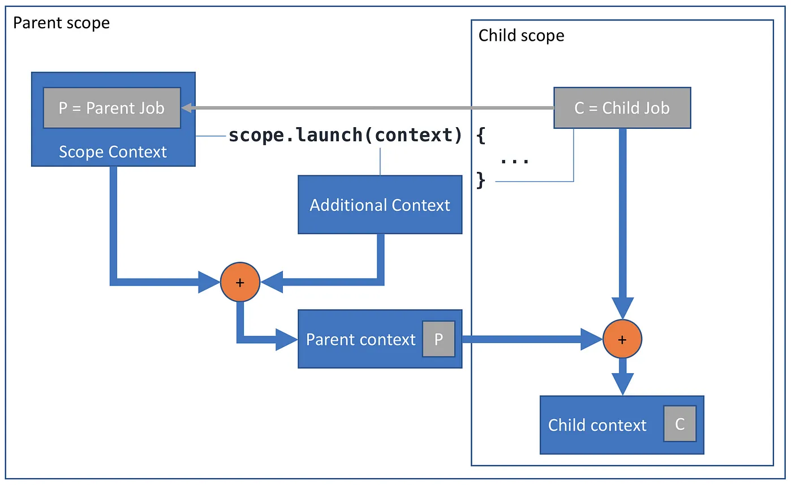

# Coroutine

- A coroutine is an instance of a suspendable computation.
- A coroutine is not bound to any particular thread. It may suspend its execution in one thread and resume in another one.

# Suspend

- `ScheduledExecutorService` is used internally for the suspend mechanism of a coroutine.
- [How does suspension work in Kotlin coroutines?](https://kt.academy/article/cc-suspension?source=post_page-----73d0194507ab--------------------------------)

# Blocking vs Suspending

- Suspending a coroutine does not block the underlying thread, but allows other coroutines to run and use the underlying thread for their code.
- Threads are expensive resources and blocking them is inefficient and is often not desired.
- [Kotlin Coroutines : Suspending vs Blocking](https://yveskalume.medium.com/kotlin-coroutines-suspending-vs-blocking-73d0194507ab#:~:text=Suspending%20allows%20a%20coroutine%20to,in%20terms%20of%20resource%20usage.)

# Coroutine Builders

- Launch
- Async
- RunBlocking
  - A coroutine builder that bridges the non-coroutine world and coroutine code.
  - Blocks the thread until all the coroutines inside runBlocking complete their execution.
- CoroutineScope
  - Suspending block.

# Structured Concurrency

- New coroutines can only be launched in a specific CoroutineScope.
- Structured concurrency ensures that coroutines are not lost and do not leak.
- An outer scope cannot complete until all its children coroutines complete.
- Structured concurrency also ensures that any errors in the code are properly reported and are never lost.

# Special Suspend Functions

- Delay
- CoroutineScope
- withContext

# Other topics

# suspendCoroutine

- To turn a callback function into a suspending function.

# suspendCancellableCoroutine

- Same as `suspendCoroutine` with cancellation support.

# suspendCoroutineUninterceptedOrReturn

# Continuation

- The continuation is an object that stores the state of the coroutine.
- It must also store the local variables and the place where the coroutine was suspended.

# Job

# Coroutine scope vs Coroutine Context

# Resources

- [Coroutine Context and Scope](https://elizarov.medium.com/coroutine-context-and-scope-c8b255d59055)
- [Coroutines with Roman Elizarov](https://soundcloud.com/user-38099918/coroutines-with-roman-elizarov)
